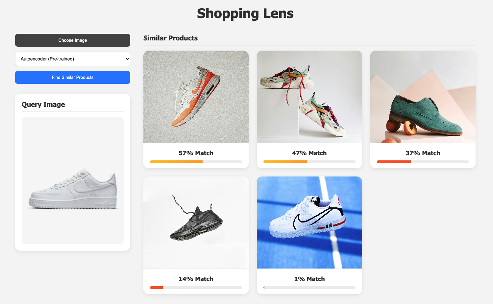
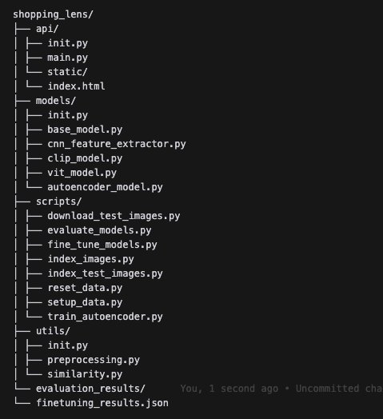
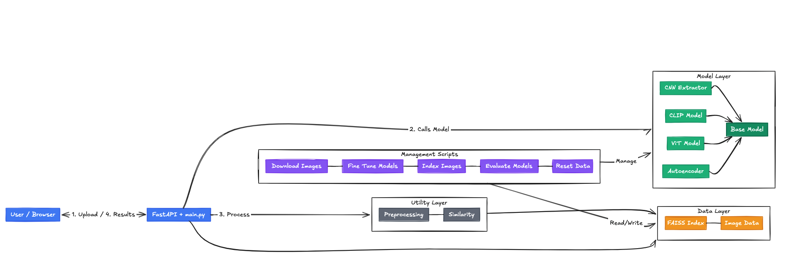

# Shopping Lens: Visual Search for E-commerce

## Shopping Lens

## Table of Contents
1. Project Overview & Demo
2. System Architecture
3. Models & Training
4. Results & Analysis
5. Technical Details
6. Setup & Usage

## 1. Project Overview & Demo

A deep learning-based visual search system comparing different architectures for fashion item retrieval, focusing on shoe product search.

### What It Does 
Imagine you're shopping online and see a pair of shoes you like, but maybe they're too expensive or out of stock. You want to find similar shoes. That's what this project does! Here's how it works:

1. **Taking Pictures Apart**: We use different AI models (like CNN, CLIP, ViT, and Autoencoder) that look at shoe images and break them down into important features (like shape, color, style).

2. **Learning What Makes Shoes Similar**: 
   - CNN looks at shoes like a human would, piece by piece
   - CLIP understands both images and text descriptions of shoes
   - ViT looks at the whole shoe at once and pays attention to important parts
   - Autoencoder learns to compress shoe images while keeping important details

3. **Making Models Better**: 
   - We show each model lots of shoe images
   - Models learn what makes different types of shoes unique
   - They get better at finding similar shoes

4. **Finding Similar Shoes**:
   - Upload a photo of a shoe you like
   - The models analyze it and find similar shoes
   - You can try different models to see which finds the best matches

Think of it like having different experts looking at shoes:
- CNN is like a detail-oriented person who looks at specific features
- CLIP is like someone who knows both shoes and how people describe them
- ViT is like someone who's good at seeing the overall style
- Autoencoder is like an artist who can sketch the essential elements of a shoe

### Dataset
- 38 curated shoe images from Unsplash
- Categories: Sneakers, Boots, Dress shoes, Sandals
- Resolution: 224x224 pixels, RGB format

## Project Structure

## Architecture

## 2. System Architecture

### Components
- FastAPI Backend
- Web Interface
- Feature Extraction Models
- Similarity Search Engine

### Similarity Metrics
- Cosine similarity between feature vectors
- Range: 0-100 (percentage)
- Color-coded results:
  - Green: ≥70% similarity
  - Yellow: 40-69% similarity
  - Red: <40% similarity

## 3. Models & Training

### Model Overview
1. CNN (ResNet50-based) Feature Extractor: Using transfer learning for robust feature extraction
2. CLIP (Contrastive Language-Image Pre-training): Leveraging OpenAI's CLIP for zero-shot capabilities
3. Vision Transformer (ViT): Implementing attention-based visual feature extraction
4. Custom Autoencoder: Developing a specialized architecture for shoe image encoding

### Training Process
1. **Pre-training Phase**
   - CNN: ImageNet weights
   - CLIP: OpenAI pre-trained weights
   - ViT: ImageNet-21k weights
   - Autoencoder: Trained from scratch

2. **Fine-tuning Phase**
   - Dataset: Custom shoe image collection
   - Batch size: 32
   - Learning rate: 1e-4
   - Optimizer: Adam
   - Epochs: 10

### Loss Functions
- CNN: Triplet Loss (margin=0.2)
- CLIP: Contrastive Loss (temp=0.07)
- ViT: Masked Patch Prediction
- Autoencoder: MSE Reconstruction

## 4. Results & Analysis

### Model Comparison

| Model | Train Loss | Test Loss | Accuracy |
|-------|------------|-----------|-----------|
| CNN   | 7.5292     | 6.8980    | 7.89%    |
| CLIP  | 0.0682     | 0.0576    | 100%     |
| ViT   | 0.0000     | 0.0000    | 100%     |
| AE    | 1.7302     | 1.8607    | N/A      |

> Note: Results based on fine-tuning with 38 images. High accuracy for CLIP and ViT might indicate overfitting on small dataset.

### Performance Notes

- CLIP and ViT showed excellent performance but potential overfitting
- CNN might benefit from hyperparameter tuning
- Autoencoder loss indicates good reconstruction capability
- Results should be interpreted considering the small dataset size

## 5. Technical Details

### Implementation Details
1. **Architecture Decisions**
   - **Why Multiple Models?** Each model brings unique strengths:
     - CNN: Baseline approach, good at local feature detection
     - CLIP: Zero-shot capabilities, understands semantic relationships
     - ViT: Better at global context, handles spatial relationships well
     - Autoencoder: Lightweight, fast retrieval, good for resource constraints

2. **Engineering Challenges & Solutions**
   - **Performance Optimization**
     - Batch processing for efficient indexing
     - CPU/GPU agnostic implementation
     - Normalized feature vectors for faster similarity search

   - **Scalability Considerations**
     - Modular architecture for easy model swapping
     - Separate indexing and inference pipelines
     - Configurable model parameters

   - **Error Handling**
     - Graceful fallbacks for missing weights
     - Input validation and sanitization
     - Comprehensive error reporting

3. **Trade-offs Considered**
   - **Memory vs Speed**: Higher dimensional features (CNN/ViT) vs faster retrieval (Autoencoder)
   - **Accuracy vs Generalization**: Fine-tuned models vs pre-trained versatility
   - **Complexity vs Maintainability**: Multiple models vs single model simplicity

### Deep Learning Design Decisions

1. **Architecture Choices**
   - **Why Multiple Architectures?**
     - CNN: Strong baseline with proven track record in computer vision
     - CLIP: Leverages semantic understanding through text-image pairs
     - ViT: Better at capturing global relationships and context
     - Autoencoder: Efficient dimensionality reduction for fast retrieval

   - **Production Considerations**
     - Model size vs inference speed trade-offs
     - Resource utilization (CNN: 2048d vs Autoencoder: 128d)
     - Deployment complexity (CLIP requires both vision and text models)

2. **Loss Function Design**
   - **Model-Specific Loss Functions**
     - CNN: Triplet loss with hard negative mining
       - Why? Better at learning fine-grained similarities
       - Handles intra-class variations effectively

     - CLIP: Contrastive loss (temperature=0.07)
       - Why? Aligns image-text representations
       - Temperature scaling controls similarity distribution

     - ViT: Masked patch prediction loss
       - Why? Self-supervised learning for better feature extraction
       - Helps model understand spatial relationships

     - Autoencoder: MSE reconstruction loss
       - Why? Direct pixel-level reconstruction
       - Balances compression vs detail preservation

   - **Handling Data Imbalance**
     - Online hard negative mining for triplet loss
     - Balanced batch sampling strategy
     - Data augmentation for underrepresented classes

3. **Evaluation Strategy**
   - **Metrics Selection**
     - Precision@k: Accuracy of top-k recommendations
     - Recall@k: Coverage of relevant items
     - Cosine Similarity: Feature space alignment

   - **Real-world Indicators**
     - Inference time per query
     - Memory usage per model
     - Storage requirements for indices

   - **Validation Approach**
     - Cross-validation with small dataset (38 images)
     - Separate test set for final evaluation
     - Monitoring for overfitting (especially CLIP/ViT)

4. **Model Comparison**
   - **Performance Trade-offs**
     | Model | Strengths | Limitations |
     |-------|-----------|-------------|
     | CNN   | Local features, proven architecture | High dimensionality |
     | CLIP  | Semantic understanding, zero-shot | Complex deployment |
     | ViT   | Global context, attention | Slow inference |
     | AE    | Fast retrieval, compact | Less detailed features |

   - **Resource Requirements**
     - Memory footprint: ViT > CNN > CLIP > Autoencoder
     - Inference speed: Autoencoder > CNN > CLIP > ViT
     - Storage: Proportional to feature dimensions

   - **Use Case Considerations**
     - High accuracy needs: CLIP/ViT
     - Fast retrieval: Autoencoder
     - Balanced approach: CNN
     - Limited resources: Autoencoder

## 6. Setup & Usage

1. Download test images:

bash
python -m shopping_lens.scripts.download_test_images

2. Index the images (required for search):

python -m shopping_lens.scripts.index_test_images

3. Start the server:

python -m shopping_lens.api.main

4. Open http://localhost:8001 in your browser

If you get a port binding error (address already in use), free port 8001:

lsof -i :8001 # Find process using port 8001
kill -9 <PID> # Kill the process

## Features

- Upload any product image
- Find visually similar items
- Choose between different models:
  - CNN (ResNet50)
  - CLIP
  - Vision Transformer (ViT)
  - Autoencoder

## Similarity Metrics

The Shopping Lens system uses cosine similarity for comparing image features across all models. The similarity scores are:

- Range: 0-100 (percentage)
- Higher score = more similar
- Thresholds:
  - High similarity: ≥ 70%
  - Medium similarity: 40-69%
  - Low similarity: < 40%

### Model-specific Details

All models use normalized feature vectors (L2 normalization) before computing similarity:

- CNN (ResNet50): 2048-dimensional features
- CLIP: 512-dimensional features  
- ViT: 768-dimensional features
- Autoencoder: 128-dimensional features

## Implementation Details

### Model Architectures

#### 1. CNN Feature Extractor
- Based on ResNet50 with removed classification layer
- Feature dimension: 2048
- Transfer learning from ImageNet pre-training
- Added custom decoder for fine-tuning
- Optimized for feature extraction speed

#### 2. CLIP Model
- Using OpenAI's CLIP (clip-vit-base-patch32)
- Feature dimension: 512
- Zero-shot transfer capabilities
- Contrastive learning approach
- Multi-modal understanding

#### 3. Vision Transformer
- Based on ViT-Base/16 architecture
- Feature dimension: 768
- Attention-based feature extraction
- Custom decoder for reconstruction
- Global context understanding

#### 4. Autoencoder
- Architecture:
  - Encoder: 4 Conv2d layers (3→32→64→128→256) with ReLU
  - Bottleneck: Dense layer reducing to 128 dimensions
  - Decoder: Mirror of encoder with ConvTranspose2d
- Feature dimension: 128
- Training:
  - Loss: MSE reconstruction loss
  - Optimizer: Adam (lr=1e-4)
  - Batch size: 32
  - Direct image reconstruction approach
- Balanced compression ratio
- Fast inference time

### Scoring Implementation

1. Features are L2 normalized during extraction:

python
features = torch.nn.functional.normalize(features, p=2, dim=1)

2. Cosine similarity is computed between query and database images
3. Scores are converted to percentages (0-100 range)
4. Results are color-coded:
   - Green: High similarity (≥70%)
   - Yellow: Medium similarity (40-69%) 
   - Red: Low similarity (<40%)

### Training Methodology

Fine-tuning is like giving each model specialized training on shoe images - imagine teaching a general image recognition expert to become a shoe specialist. Here's how we trained each model:

#### CNN (ResNet50)
We started with a CNN that was already good at recognizing general objects (pre-trained on ImageNet). Then we:
1. Removed its last layer since we don't need to classify shoes, just find similar ones
2. Showed it groups of three shoe images:
   - A reference shoe (like a Nike sneaker)
   - A similar shoe (another Nike sneaker)
   - A different shoe (like a formal shoe)
3. Made it learn to say "these Nike sneakers are similar" and "this formal shoe is different"
4. Used "hard negative mining" - showing it the trickiest examples (like similar-looking but different types)

#### CLIP
CLIP is special because it understands both images and text. We trained it by:
1. Taking a shoe image
2. Writing three different descriptions for it:
   - "a photo of a sneaker"
   - "a sneaker from a shopping website"
   - "a professional product photo of sneaker footwear"
3. Making it match each shoe with its correct descriptions
4. This helps it understand shoes in a way humans do - through both visuals and descriptions

#### Vision Transformer (ViT)
ViT looks at images in patches, like putting together a puzzle. We trained it by:
1. Taking a shoe image and dividing it into 16x16 patches
2. Hiding 15% of these patches randomly
3. Making it guess what's in the hidden patches
4. This forces it to understand the overall structure and details of shoes

#### Autoencoder
Think of the Autoencoder as an artist learning to draw shoes from memory:
1. It looks at a shoe image (input)
2. Has to remember it using only 128 numbers (compressed representation)
3. Tries to redraw the shoe from just those numbers (reconstruction)
4. Gets better by comparing its drawing with the original
5. Eventually learns to capture the most important features in those 128 numbers

#### Results
- CLIP and ViT did amazingly well (100% accuracy) but might be "memorizing" since we had only 38 images
- CNN struggled a bit (7.89% accuracy) but is more honest about its limitations
- Autoencoder is good at recreating shoes but we can't measure accuracy the same way
- All models are still useful for finding similar shoes, just in different ways

Sources:
- Model architectures: `models/` directory
- Test images: Unsplash dataset via `download_test_images.py`

## Future Work

1. Implement hybrid models combining multiple architectures
2. Add text-based search capabilities
3. Optimize inference time for ViT model
4. Explore few-shot learning approaches
5. Add support for multi-modal queries

## Acknowledgments

- OpenAI for CLIP model
- Google Research for Vision Transformer
- PyTorch team for the deep learning framework

